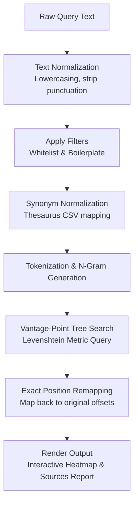

# 🌲 Vantage-Point Tree (VP-Tree) Plagiarism Detector

An advanced, fast, and memory-efficient local plagiarism detection engine designed for indexing and searching text documents. Built with high-performance C++17, a custom metric space index (Vantage-Point Tree), and a rich graphical user interface using **Qt 6**.

This application indexes database documents by converting them into $N$-grams and structuring them in a VP-Tree. Suspect query documents can then be scanned in real-time, matching overlapping $N$-grams using **Levenshtein Edit Distance** as a metric. Matching areas are highlighted on an interactive heatmap, and source documents are ranked by their matched density and similarity.

---

## 📊 Architectural Overview

The diagram below demonstrates how query text is processed, normalized, and mapped through the pipeline before being matched against the Vantage-Point Tree index:



---

## ✨ Key Features

1. **Vantage-Point (VP) Tree Indexing**:
   * Custom metric-space index tree ([VPTree](file:///d:/vptree_plagiarism_detector - interim demo ver/plagiarism_detector/src/vptree.h#L24)) implemented from scratch using raw pointers.
   * Efficiently indexes document $N$-grams ([NGram](file:///d:/vptree_plagiarism_detector - interim demo ver/plagiarism_detector/src/ngram.h#L7)) and executes spatial search queries.
2. **Levenshtein Distance Metric**:
   * Calculates local textual similarity using a space-optimized 2-row dynamic programming edit-distance matrix ([VPTree::distance_metric](file:///d:/vptree_plagiarism_detector - interim demo ver/plagiarism_detector/src/vptree.h#L79)).
   * Robust against character insertions, deletions, and substitutions (e.g., typos, formatting tweaks).
3. **Advanced Text Preprocessing Pipeline**:
   * **Text Normalization**: Standardizes character sets by case folding (lowercasing), stripping special symbols/punctuation, and consolidating whitespace.
   * **Boilerplate Detection**: Automatically identifies common headers, institutional disclaimers, or templates appearing across database files (based on a frequency threshold) and removes them to prevent false positive matches ([PlagiarismEngine::detectBoilerplate](file:///d:/vptree_plagiarism_detector - interim demo ver/plagiarism_detector/src/engine.h#L139)).
   * **Whitelist Filtering**: Ignores user-defined terms or phrases during indexing and scanning with strict word-boundary validation ([PlagiarismEngine::applyWhitelist](file:///d:/vptree_plagiarism_detector - interim demo ver/plagiarism_detector/src/engine.h#L97)).
   * **Thesaurus-Synonym Normalization**: Neutralizes synonym-substitution plagiarism by mapping similar words to canonical roots (e.g., mapping "quickly", "fast", "rapid" to `SPEED_ADJ`) before generating $N$-grams ([PlagiarismEngine::loadSynonymDictionary](file:///d:/vptree_plagiarism_detector - interim demo ver/plagiarism_detector/src/engine.h#L145)).
4. **Interactive Document Heatmap**:
   * Rich Qt 6 text display component ([QTextEdit](file:///d:/vptree_plagiarism_detector - interim demo ver/plagiarism_detector/src/mainwindow.h#L100)) highlighting matching/plagiarized regions in **red** and original text in **white/normal** ([MainWindow::applyHeatmap](file:///d:/vptree_plagiarism_detector - interim demo ver/plagiarism_detector/src/mainwindow.h#L71)).
   * Features exact, character-level reverse-position mapping from preprocessed text offsets back to original file coordinates.
5. **Ranked Source Attribution**:
   * Scores and displays source documents ranked by density of matched $N$-grams, coverage percentage, and average similarity score ([PlagiarismEngine::rankSources](file:///d:/vptree_plagiarism_detector - interim demo ver/plagiarism_detector/src/engine.h#L181)).
6. **Multi-threaded Execution**:
   * Heavy scanning operations run on a background worker thread ([ScanWorker](file:///d:/vptree_plagiarism_detector - interim demo ver/plagiarism_detector/src/mainwindow.h#L19)) to maintain responsive GUI interactions.
7. **Diagnostics & Logging**:
   * Interactive live stats demonstrating active VP-Tree size (nodes) and height.
   * Step-by-step pipeline tracing printed via callback functions to track metrics and search steps.

---

## 🧠 Core Algorithms & Data Structures

### 1. Vantage-Point Tree Partitioning
A VP-Tree structures objects in a metric space $(X, d)$ using a distance metric $d$ satisfying the triangle inequality.
For each node ([VPTreeNode](file:///d:/vptree_plagiarism_detector - interim demo ver/plagiarism_detector/src/vptree.h#L9)):
* A **vantage point** (pivot) $v \in X$ is selected from the dataset.
* The **median distance** $\mu$ from $v$ to all other items in the node is calculated.
* The dataset is partitioned into:
  * **Left Subtree**: $\{x \in X \setminus \{v\} \mid d(v, x) \le \mu\}$
  * **Right Subtree**: $\{x \in X \setminus \{v\} \mid d(v, x) > \mu\}$

#### Selection Heuristic:
Vantage points are selected by sampling a subset of candidates and selecting the one that maximizes the **variance** of distances to a sample of other points. This ensures a balanced partitioning across the metric space ([VPTree::select_vantage_point](file:///d:/vptree_plagiarism_detector - interim demo ver/plagiarism_detector/src/vptree.h#L68)).

#### Tie-Balancing (Alternation):
If many elements share a distance equal to the median $\mu$ (common in discrete integer-valued metrics like edit distance), the tree can degrade into a long linked-list. The builder alternates duplicate-distance items between the left and right subtrees to preserve tree balance ([VPTree::buildRecursive](file:///d:/vptree_plagiarism_detector - interim demo ver/plagiarism_detector/src/vptree.h#L37)).

### 2. Search Pruning via Triangle Inequality
When querying the tree with a target $q$ and search radius $r$:
* Compute $d = d(v, q)$.
* If $d \le r$, the vantage point $v$ is a match.
* **Pruning Rules**:
  * We search the **left child** if $d - r \le \mu$ (i.e., some matches might lie inside the partition boundary).
  * We search the **right child** if $d + r \ge \mu$ (i.e., some matches might lie outside the partition boundary).

This pruning discards large subtrees, reducing search complexity from $O(N)$ to $O(\log N)$ on average.

---

## 📁 Project Structure

* **[src/vptree.h](file:///d:/vptree_plagiarism_detector - interim demo ver/plagiarism_detector/src/vptree.h) / [src/vptree.cpp](file:///d:/vptree_plagiarism_detector - interim demo ver/plagiarism_detector/src/vptree.cpp)**: Vantage-point tree data structure, node representation ([VPTreeNode](file:///d:/vptree_plagiarism_detector - interim demo ver/plagiarism_detector/src/vptree.h#L9)), recursive partitioning, median quickSelect, and tree-search algorithms (Range and KNN).
* **[src/engine.h](file:///d:/vptree_plagiarism_detector - interim demo ver/plagiarism_detector/src/engine.h) / [src/engine.cpp](file:///d:/vptree_plagiarism_detector - interim demo ver/plagiarism_detector/src/engine.cpp)**: Text preprocessing engine ([PlagiarismEngine](file:///d:/vptree_plagiarism_detector - interim demo ver/plagiarism_detector/src/engine.h#L77)), synonym mappings, whitelist operations, auto-boilerplate detection, $N$-gram generation, scanning orchestrator, and source ranking.
* **[src/ngram.h](file:///d:/vptree_plagiarism_detector - interim demo ver/plagiarism_detector/src/ngram.h) / [src/ngram.cpp](file:///d:/vptree_plagiarism_detector - interim demo ver/plagiarism_detector/src/ngram.cpp)**: Structures for [NGram](file:///d:/vptree_plagiarism_detector - interim demo ver/plagiarism_detector/src/ngram.h#L7) (with index, start/end bounds, source file), [SearchResult](file:///d:/vptree_plagiarism_detector - interim demo ver/plagiarism_detector/src/ngram.h#L26), and [MatchSegment](file:///d:/vptree_plagiarism_detector - interim demo ver/plagiarism_detector/src/ngram.h#L35).
* **[src/rawbuffer.h](file:///d:/vptree_plagiarism_detector - interim demo ver/plagiarism_detector/src/rawbuffer.h)**: A templated, custom-managed dynamic array ([RawBuffer](file:///d:/vptree_plagiarism_detector - interim demo ver/plagiarism_detector/src/rawbuffer.h#L9)) written to reduce library overhead and ensure manual control over allocations.
* **[src/mainwindow.h](file:///d:/vptree_plagiarism_detector - interim demo ver/plagiarism_detector/src/mainwindow.h) / [src/mainwindow.cpp](file:///d:/vptree_plagiarism_detector - interim demo ver/plagiarism_detector/src/mainwindow.cpp)**: Qt 6 UI implementation ([MainWindow](file:///d:/vptree_plagiarism_detector - interim demo ver/plagiarism_detector/src/mainwindow.h#L40)) containing stylesheets, layout panels, progress bars, interactive events, database lists, and the HTML-formatted heatmap display. Includes [ScanWorker](file:///d:/vptree_plagiarism_detector - interim demo ver/plagiarism_detector/src/mainwindow.h#L19) thread class.
* **[src/main.cpp](file:///d:/vptree_plagiarism_detector - interim demo ver/plagiarism_detector/src/main.cpp)**: Application entry point initializing the Qt event loop and displaying the main window.
* **[src/test_engine.cpp](file:///d:/vptree_plagiarism_detector - interim demo ver/plagiarism_detector/src/test_engine.cpp)**: Comprehensive automated test suite validating [RawBuffer](file:///d:/vptree_plagiarism_detector - interim demo ver/plagiarism_detector/src/rawbuffer.h#L9), distance calculations, tree insertion/deletion/rebuilding, CRUD operations, boilerplate detection, synonym mapping reports, and full-pipeline scanning.
* **[sample_data/](file:///d:/vptree_plagiarism_detector - interim demo ver/plagiarism_detector/sample_data)**: Sample database files, suspicious query documents, and synonym thesaurus CSV mappings to support quick demos.

---

## 🛠️ How to Build & Run

### 📋 Prerequisites
* A C++17 compliant compiler (such as GCC/MinGW-w64 or MSVC).
* **Qt 6 SDK** installed on your system.
* CMake (optional, for standard cross-platform builds).

---

### 🚀 Windows Command Scripts
The root directory provides several automation script files to build and execute the project:

#### 1. Build the GUI Application
Runs Qt Meta-Object Compiler (`moc`) on the window header, compiles all C++ source files linked against Qt 6, and deploys local Qt graphical DLLs using `windeployqt`:
```cmd
build_qt6_app.bat
```

#### 2. Run the Application
Launches the built application executable:
```cmd
run_qt6_app.bat
```

#### 3. Build the Unit Tests
Compiles the command-line test runner executable containing the automated unit tests:
```cmd
build_tests.bat
```

#### 4. Run Everything (No Pause)
Builds the app and tests, executes all automated tests, prints progress, and opens the GUI application in sequence:
```cmd
run_all_no_pause.bat
```

---

### 📦 Standard CMake Build
You can build the project with standard CMake commands:

```bash
mkdir build
cd build
cmake ..
cmake --build .
```

* This generates two main executable targets:
  * `PlagiarismApp`: The main graphical user interface.
  * `UnitTests`: The CLI testing suite.

---

## 💡 Using the Demos
Once the GUI application is running, you can test its features using the built-in quick demos:
1. **Load Quick Demo**: Click the **"Load Quick Demo"** button. This automatically indexes sample documents `database_doc1.txt` through `database_doc9.txt`, loads the suspicious query document `query_suspicious.txt`, runs a background scan, and generates the highlighted document heatmap.
2. **Load Synonym Demo**: Click the **"Load Synonym Demo"** button. This loads `synonyms.csv` (mapping terms like "residing" $\to$ `RESIDE_VB`), indexes `database_urban.txt`, reads `query_thesaurus.txt` (which has paraphrased synonyms), runs the scan, and prints the active word substitutions in the synonym console log.
3. **Auto-Detect Boilerplate**: Click **"Auto-Detect from Documents"** to scan the indexed files, extract repetitive academic or course headers, and rebuild the tree index to filter those phrases out automatically.
